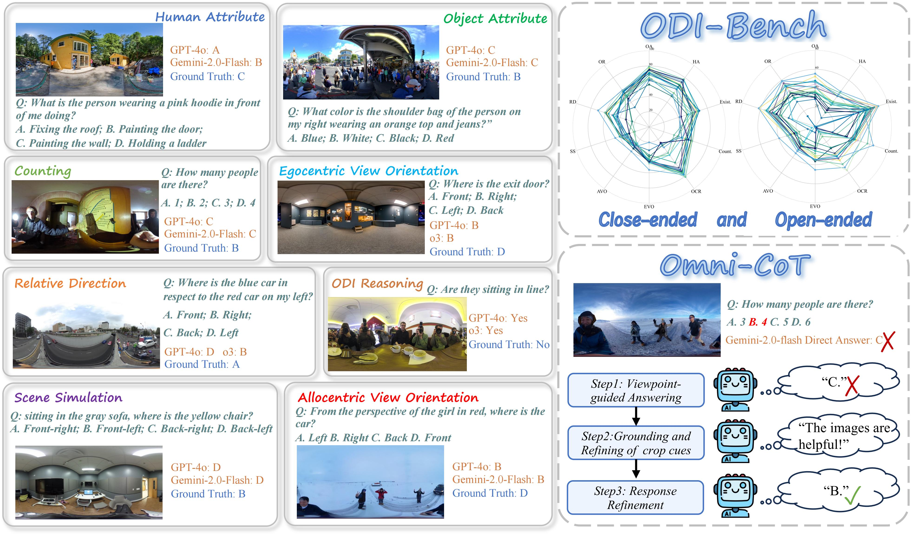

<div align="center">

# ODI-Bench: CAN MLLMS UNDERSTAND IMMERSIVE OMNIDIRECTIONAL ENVIRONMENTS?

</div>

<div align="center">
  
[](https://arxiv.org/pdf/2510.11549)
[](https://huggingface.co/datasets/LiuYang66/ODI-Bench/tree/main)

</div>

<div align="center">

<p>
  <a href="https://scholar.google.com/citations?user=-pD_qMYAAAAJ&hl=zh-CN">Liu Yang</a><sup>1</sup>*,
  <a href="https://scholar.google.com/citations?hl=zh-CN&user=r0bRaCMAAAAJ">Huiyu Duan</a><sup>1</sup>*†,
  Ran Tao<sup>2</sup>,
  Juntao Cheng<sup>1</sup>,
  Sijing Wu<sup>1</sup>,
  <a href="https://scholar.google.com/citations?hl=zh-CN&user=GNk1yVkAAAAJ">Yunhao Li</a><sup>1</sup>,
  Jing Liu<sup>3</sup>,
  <a href="https://scholar.google.com/citations?hl=zh-CN&user=GNk1yVkAAAAJ">Xiongkuo Min</a><sup>1</sup>,
  <a href="https://scholar.google.com/citations?hl=zh-CN&user=E6zbSYgAAAAJ">Guangtao Zhai</a><sup>1</sup>
</p>

<p>
  <sup>1</sup>Shanghai Jiao Tong University ·
  <sup>2</sup>Xinjiang University ·
  <sup>3</sup>Tianjin University
</p>

<p>
  * Equal contribution. † Corresponding author.
</p>

</div>

---

<div align="center">
  
</div>

*Omnidirectional images (ODIs) provide full 360° × 180° view which are widely adopted in VR, AR and embodied intelligence applications. While multi-modal large language models (MLLMs) have demonstrated remarkable performance on conventional 2D image and video understanding benchmarks, their ability to comprehend the immersive environments captured by ODIs remains largely unexplored. To address this gap, we first present **ODI-Bench**, a novel comprehensive benchmark specifically designed for omnidirectional image understanding. We further introduce **Omni-CoT**, a training-free method which significantly enhances MLLMs’ comprehension ability in the <u>omni</u>directional environment through <u>c</u>hain-<u>o</u>f-<u>t</u>hought reasoning across both textual information and visual cues.*

## Release

---

- `2026-03-09` ❤️ The benchmark is currently released on [Hugging Face](https://huggingface.co/datasets/LiuYang66/ODI-Bench/tree/main)!
- `2026-01-26` 🚀 Our paper `ODI-BENCH` is accepted by ICLR 2026! See u in Brazil!

---
If you find our work useful, please cite:

> ```bibtex
> @article{yang2025odi,
>  title={ODI-Bench: Can MLLMs Understand Immersive Omnidirectional Environments?},
>  author={Yang, Liu and Duan, Huiyu and Tao, Ran and Cheng, Juntao and Wu, Sijing and Li, Yunhao and Liu, Jing and Min, Xiongkuo and Zhai, Guangtao},
>  journal={arXiv preprint arXiv:2510.11549},
>  year={2025}
>}
> ```
